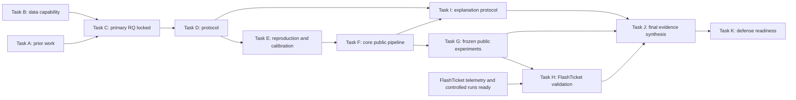

# RCA Master Research Program — Task A đến bảo vệ

Chủ sở hữu: **Minh**, phụ trách RCA. Phiên bản `MRP-v1.1`, cập nhật 2026-09-23; bản MRP-v1 ngày22/09 giữ trong lịch sử Git. Lớp: `ROADMAP / FORMATION`. Đây là lộ trình RCA duy nhất; [CURRENT-STATE](CURRENT-STATE.md) là nơi duy nhất theo dõi trạng thái chạy hiện tại. Các quyết định con người nằm ở [RESEARCH-DECISIONS](RESEARCH-DECISIONS.md), hợp đồng nghiên cứu ở [C Phase 2](task-c-research-decision-lock.md). Cách sắp công việc/gate ở đây là thiết kế điều phối để thực hiện yêu cầu U22, không tự là human approval cho phương pháp chưa chọn.

## 1. Mục tiêu, trách nhiệm và các nghĩa khác nhau

Đáp ứng phần phương pháp/chẩn đoán của [DT18](../evidence/project-direction/2026-09-18-de-tai-va-nhiem-vu.md): pipeline có graph, log/trace/metrics, detection và RCA, giải thích bằng chứng, thực nghiệm công khai rồi kiểm chứng FlashTicket. Chấp nhận empirical/system/reproducibility contribution và kết quả âm hợp lệ. Không hứa điểm, novelty hoặc graph luôn tốt hơn. Mục tiêu kết quả mạnh nghĩa bằng chứng thuyết phục, không buộc effect dương.

| Vai trò | Thành phần | Quyền tuyên bố |
|---|---|---|
| RESEARCH QUESTION | **C1 mandatory** | Giá trị observed service relations trong pipeline/controls/budget được kiểm, với service ranking GT |
| OPTIONAL EXTENSION | C2 | Evidence-budget dependence sau C1 ổn định; không yêu cầu để luận văn thành công |
| SUPPORTING DESIGN / ABLATION | C3, C4 phải hiện diện | C3 operation-aware evidence; C4 graph placement. D phải giải thích dùng/không dùng, exact experiment conditional; không novelty độc lập |
| SYSTEM CAPABILITY | C5 và LLM mandatory intended capabilities | Detection → RCA và downstream explanation; mỗi capability có kiểm chứng riêng, không lấy điểm ranking thay tất cả |
| DEMO FEATURE | Hiển thị graph/rank/evidence/explanation | Chỉ chứng minh thao tác đã chạy; hình đẹp không chứng minh hiệu quả |
| GROUND-TRUTH-EVALUABLE OUTPUT | RE2-TT service rank; bounded regime; FlashTicket theo nhãn thực có | Không operation-root/affected-node/path accuracy khi thiếu nhãn; explanation faithfulness khác diagnosis correctness |

Đọc contract chi tiết ở C Phase 2, không nhân bản ở mọi task. C2 chỉ được xét sau valid C1, không buộc thiết kế C1 phức tạp để dự phòng. C3/C4 phải có mục trong D và J, kể cả quyết định không thực hiện một ablation có lý do. Không đổi chúng thành discarded. C5/LLM chưa xong phải báo chưa xong; không dùng “không phải primary RQ” để xóa năng lực cuối.

**RCA-only:** không chứa backlog chức năng bán vé. H nhận readiness/telemetry từ người sở hữu hệ thống qua đúng hai cửa tại §8. D–G không đợi backend. Không giả định Minh thiếu thời gian để cắt mục tiêu; effort/risk được dùng để chọn cách thực hiện phù hợp, không giảm nghĩa vụ đã chốt.

## 2. Đường phụ thuộc và các điểm khóa



ID là trách nhiệm, không phải lịch cứng buộc tất cả chạy tuần tự. I có thể phát triển/đánh giá trên evidence packet công khai từ F, song song G và trước H; phần kiểm chứng explanation trên FlashTicket hoàn tất sau H. J thu claim/evidence từ mỗi task ngay khi có kết quả, chỉ **finalize** sau G/H/I. K có thể soạn question bank sớm, nhưng demo/slide freeze và rehearsal dùng bằng chứng J cuối. C2 nếu được chọn là nhánh G bổ sung sau core C1, không nằm critical path.

**Freeze và vòng sửa có kiểm soát:** D tạo protocol v1; E có thể lộ baseline/schema/calibration incompatibility; sửa D có changelog và review trước khi chốt version dùng cho F/G. E không dùng final-test labels để tune. Trước G, đóng scope/config/metric/controls/split/evaluator. Mọi sửa sau xem test phải version, giữ run cũ, ghi exploratory; không giả là confirmatory mới trên cùng test. Reproduction/adaptation không cần được quảng cáo là exact replication nếu điều kiện khác.

**Ranh giới trước pilot:** trước E, D phải định danh development/calibration scope và phần giữ lại cho final evaluation theo thiết kế sẽ được chọn. Ghi exposure ledger cả các ca đã xem khi audit A/B/C và những ca dùng trong E/F, phân biệt xem schema với xem outcome/score để lựa chọn thiết kế. Không gán một ca đã dùng chọn feature/parameter/control thành “untouched test” chỉ bằng sửa split; mọi thay đổi phải giữ lịch sử tiếp xúc và giải thích claim còn hợp lệ tới đâu. Quy tắc này không chọn sẵn tỷ lệ split hoặc loại bỏ các ca audit.

**Status snapshot khi lập MRP:** Task A COMPLETE (evidence map; nguồn vẫn DRAFT về phê duyệt), Task B COMPLETE/CLOSED, Task C Phase 1+2 COMPLETE. D–K chưa thực hiện; trạng thái sống đọc CURRENT-STATE. Lập roadmap không cấp quyền chạy D/E/F/G hoặc tải/cài dữ liệu/framework.

**Bổ sung TD-v1.1, 23/09:** [nguồn advisor riêng](../evidence/advisor-direction/2026-09-23-huong-dan-do-minh-cung-cap.md) và RCA-018–021 xác định hướng dẫn phương pháp cũ còn giá trị, không giảm phạm vi DT18 của FlashTicket. [TD-v1.1 §10/15](task-d-method-and-experiment-specification.md) đặc tả C5 graph-conditioned trước alert, M/T/L node evidence với trace structure riêng; C1 giữ nguyên. Đây là thiết kế CANDIDATE chờ Minh, không mở thêm primary RQ.

**PUBLIC-EXTENSION gate (Minh + D/E, kiểm trước final public-program claim J/K):** RE2-TT vẫn primary C1. Yêu cầu nghiên cứu trên public datasets bổ sung có đường xử lý riêng: E kiểm compatibility nguồn trong scope được giao; D addendum nêu exact release/GT/graph/modalities/split/metrics và task; Minh chấp nhận scope trước retrieval/implementation campaign; F/G chạy khi được giao; J tách kết quả từng dataset. RE2-SS M/L không trace nên không lặp nguyên C1; LEMMA subdataset/graph mapping chưa verified. Không dựng graph giả, không pool GT khác mức, không dùng FlashTicket thay second-public evidence. Chưa có second dataset được chọn hoặc waived; thiếu evidence này không phá validity của narrow C1 hay chặn RE2-TT pilot đã được giao, nhưng không được tuyên bố đã hoàn thành hướng public mở rộng. Không phát sinh Task E authorization từ gate này.

## 3. Hợp đồng chung của mọi task

Mỗi task phải dùng các trường ở §4, cộng các quy tắc sau; chúng áp dụng theo tham chiếu, không cần sao chép sang từng handoff.

**Validity:** scope/task/unit/GT phải khớp. Primary C1 là known-window RCA với boundary oracle công khai; detector evaluation là nhánh riêng. Paths/root/fault/oracle metadata tách khỏi model và LLM input. Candidate universe lấy từ telemetry hợp lệ, không injected-label set. Giữ failures/missingness; kiểm leakage, feature/supervision/capacity fairness và scenario dependence; không biến spans/seeds thành incident độc lập. Graph semantics, multimodal joins và sample/full-population scope theo Task B. Không có luật mới cho supervised labels ngoài policy đã khóa.

**Reproducibility:** trước một run phải có run ID, task/protocol version, source revision, dataset file manifest/hash, code revision hoặc patch hash khi chưa commit, environment/package lock, command/config, seeds nếu có, actual input/split IDs, preprocessing/availability rules, hardware/runtime scope, output schema, per-case predictions và failure/error log. Evaluator và model-facing inputs tách biệt. Cache có source/config hash và cutoff provenance; không chia cache khiến nhìn trước. Ghi cả failed/negative runs, deviations và số ca trong mẫu số. Những việc này là output của E–I, chưa được nhận là đã có tại MRP-v1.

**Hai root và độ bền:** định vị theo logical ID + root-relative path ở ARTIFACT-MAP; absolute paths chỉ là binding máy hiện tại. Kết luận/contract/handoff trong repository, dữ liệu/run/log/checkpoint/review chi tiết ngoài workspace. Chỉ có `.git` hoặc file tại một máy không đồng nghĩa đã backup; không claim đã push/backup. Trước campaign, E xác định cách snapshot nguồn/code/manifest và bản phục hồi phù hợp quyền dùng; J/K kiểm phục hồi được. Không chuyển dataset vào repository. Không xóa/move lịch sử trong phiên thiết lập.

**Exit rule:** task hoàn tất khi có artifact + validation + handoff, không vì đã viết chữ COMPLETE. Kết quả âm hợp lệ có thể đóng experiment; kết quả invalid phải giữ và sửa protocol/code trước claim. Capability bắt buộc bị thiếu là blocker cho phần tích hợp/hoàn thiện liên quan, không blocker cho mọi nhánh độc lập. Mọi thay đổi Primary RQ/phạm vi đã chốt cần Minh; reviewer không thay quyền đó.

**Output paths:** `P = PLATFORM_ROOT/docs/research-rca`; `W = RCA_WORKSPACE_ROOT`. Đường dẫn tương lai dưới đây là hợp đồng đầu ra, **chưa tồn tại và chưa được thực thi**. Không tạo hàng loạt file rỗng. Mỗi Task D–K có một canonical `P/task-x-handoff.md`; có thể chứa summary kết quả, không thêm một báo cáo summary khác nếu cùng chức năng.

## 4. Task contracts

### Task A — Literature Evidence Map

| Trường | Hợp đồng |
|---|---|
| Purpose / RQ | Phân biệt AD, ranking, graph roles, prior work; cung cấp căn cứ C1 và chống novelty sai |
| Inputs / dependencies | Nguồn primary được kê trong Task A; DT18 và yêu cầu survey; không lấy phương pháp cũ làm mỏ neo |
| Outputs / artifacts | `P/task-a-ban-do-bang-chung-doc-lap.md`; nguồn tham khảo chung `docs/research/source-register.md` |
| Mandatory / entry | Mandatory; nhiệm vụ và phạm vi survey rõ; đã thực hiện |
| Exit | Map có sources/task distinctions/limits và dataset questions; COMPLETE work không tự APPROVED artifact |
| Scientific checks | Không so số khác dataset/protocol; không gọi graph/GNN/multimodal là mới tự thân |
| Reproducibility / evidence | Cutoff 20/09, source versions và citations; Phase 1 TV-01–04 ghi corrections có phạm vi |
| Out of scope | Bắt đầu lại survey toàn diện hoặc chọn thuật toán chỉ vì paper thắng |
| Fallback | Primary evidence thiếu thì hạ claim/kiểm hẹp tác động quyết định; không suy novelty từ thiếu kết quả tìm kiếm |
| Models / scripts / review | Strong cho interpretation; medium cho citation index; script cho IDs/links; review khoa học độc lập đã có, không rerun |
| Next handoff | Đã chuyển câu hỏi sang B và contribution gate C; D mở đúng đoạn prior liên quan comparator, không reread toàn bộ mặc định |

### Task B — Dataset / Ground-Truth Audit

| Trường | Hợp đồng |
|---|---|
| Purpose / RQ | Xác định data/graph/GT thực cho C1 và các capability hỗ trợ |
| Inputs / dependencies | Task A questions, official pinned metadata/raw selected samples; B2 full trace scope và B2B sample |
| Outputs / artifacts | `W/dataset-audit/TASK-B-RCAEval-audit.md` §12 CLOSED; `P/task-b-dataset-capability-summary.md`; manifests/scripts ở ARTIFACT-MAP |
| Mandatory / entry | Mandatory; official provenance và môi trường phù hợp; đã thực hiện |
| Exit | Capability/unsupported claims/leakage policy rõ; CLOSED. Full audit không có nghĩa full corpus đã tải |
| Scientific checks | Metadata fact khác raw sample/full-trace property; operation representation khác GT; labels khác model inputs |
| Reproducibility / evidence | Revision/hash/query scripts/manifest, counts và reviewer disagreement resolution; không fresh raw rerun trong chương trình này |
| Out of scope | Model training, baseline execution, invent semantic edges hoặc lỗi không có nhãn |
| Fallback | Khi E phát hiện schema khác: giữ failure, truy exact source/version và kiểm chọn lọc; đổi capability phải có evidence, không bỏ silent cases |
| Models / scripts / review | Strong cho meaning/leakage; medium loader; scripts cho counts/hash/schema; independent audits đã hoàn tất |
| Next handoff | D nhận capability summary; evidence chi tiết chỉ mở cho quyết định cụ thể |

### Task C — Research Direction & Decision Lock

| Trường | Hợp đồng |
|---|---|
| Purpose / RQ | Chọn C1 primary và khóa loại contribution/capability roles theo Minh |
| Inputs / dependencies | A/B; six blind proposals → gates → Red Team; U22 lựa chọn con người sau Phase 1 |
| Outputs / artifacts | Phase 1 canonical; `P/task-c-research-decision-lock.md`; `P/RESEARCH-DECISIONS.md`; hồ sơ Phase 1 giữ nguyên |
| Mandatory / entry | Mandatory; A/B có evidence; human decision explicit để đóng Phase 2 |
| Exit | RQ/conceptual hypotheses/scope/targets/exclusions/negative policy/handoff được khóa; COMPLETE theo RCA-001–017 |
| Scientific checks | Không vote reviewer, không sửa history cho giống chọn trước, không gọi acceptance là novelty proof |
| Reproducibility / evidence | Frozen Phase 1, current source IDs/date, independent workflow challenge và adjudication |
| Out of scope | Exact formulas/controls/windows/splits/baseline implementations; tất cả thuộc D/E |
| Fallback | Nếu RQ phải đổi do bằng chứng sau này: trở lại human decision, giữ version cũ; không đổi vì graph thua |
| Models / scripts / review | Strong cho decision interpretation; medium index; script preservation/links; không rerun six-reviewer pattern |
| Next handoff | Chờ lệnh bắt đầu D; dùng §6 handoff trong decision lock |

### Task D — Method and Experimental Protocol Specification

| Trường | Hợp đồng |
|---|---|
| Purpose / RQ | Chuyển C1 thành phép thử phân biệt relation utility khỏi nuisance; đặt contract cho C3/C4/C5/LLM |
| Inputs / dependencies | C Phase 2, B capability, A đoạn comparator liên quan; không cần FlashTicket runtime |
| Outputs / artifacts | `P/task-d-method-and-experiment-specification.md` (gồm evidence/adapter/LLM packet contract, C3/C4 disposition, claim register ban đầu); `P/task-d-handoff.md` |
| Mandatory / entry | Mandatory; C lock hiện hành và Minh cho phép bắt đầu D |
| Exit | Feature/reference/graph/rank/detection modes, candidate/split/metric/controls/statistics/baseline families và failure policy đủ implement; independent critique được phân xử; Minh chấp thuận protocol baseline trước execution E |
| Scientific checks | Counterfactual controls giữ được nuisance nào, không giữ được gì; held-out scope; root labels evaluation-only; known-window vs detection tách; fair local evidence ở mọi nhánh |
| Reproducibility / evidence | Specification version, per-field source/availability, planned analysis, negative/inconclusive rules; decision log và review delta. Không tính effect bằng mô hình ngôn ngữ |
| Out of scope | Chạy baseline, tải dataset, cài framework hoặc code FlashTicket; không chốt operational SLA từ event-time |
| Fallback | Không có fair comparator/control khả thi thì sửa scope phép đo và review trước run; cần đổi C1/roles phải quay Minh |
| Models / scripts / review | Strong required cho protocol/leakage/statistics; medium biên tập/contract fixtures khi được giao; script kiểm schema giả lập/tính nhất quán nếu cần; independent scientific review required |
| Next handoff | E nhận spec được chấp thuận, input requirements và reproduction acceptance criteria; quyền execution/download/install phải nằm trong lệnh E |

### Task E — Baseline Reproduction / Calibration

| Trường | Hợp đồng |
|---|---|
| Purpose / RQ | Xác nhận comparator, loader/evaluator và calibration thực sự hoạt động đúng contract trước pipeline/campaign |
| Inputs / dependencies | D approved specification, source/artifact licenses, pinned data manifest; chỉ public data, không FlashTicket |
| Outputs / artifacts | `W/baselines/` source snapshots; `W/environments/` lockfiles; `W/results/task-e/` manifests, smoke outputs, metric fixtures, resource measurements; `P/task-e-handoff.md` |
| Mandatory / entry | Mandatory; có quyền chạy E và retrieval/install cần thiết trong phạm vi được duyệt; ranh giới dữ liệu trước pilot/exposure ledger theo §2; chọn môi trường từ baseline thực, không mặc định WSL/GPU |
| Exit | Selected comparators chạy trên development/calibration scope được D cho phép; loader checks đúng data dùng; evaluator tính đúng ties/misses/failures trên fixtures; fidelity/adaptation và chi phí sơ bộ ghi rõ; D revisions đã review trước final freeze |
| Scientific checks | Không test-label tuning, không nhầm paper score với reproduced result; supervision/input compatibility; calibration detection không dùng injection oracle trái policy |
| Reproducibility / evidence | Dùng full run contract §3; lưu upstream commit, patch/license, download revision/hash, packages/command/hardware, evaluator fixture expected/actual và failures |
| Out of scope | Chạy confirmatory final test hoặc báo graph đã tốt hơn; bulk full-dataset download cho tiện |
| Fallback | Baseline không chạy/không tương thích: lưu nguyên lỗi và nguyên nhân; sửa adapter có nhãn adaptation hoặc quay D chọn comparator trước test, không âm thầm bỏ đối thủ mạnh |
| Models / scripts / review | Medium implementation/setup từ spec; strong chỉ khi đổi fidelity/fairness; deterministic scripts là chính; independent review cho evaluator/leakage/claim exact reproduction |
| Next handoff | F nhận frozen validated loader/evaluator/comparators, environment/inputs reproducible và các deviation đã xử lý |

### Task F — Core RCA Pipeline on Public Data

| Trường | Hợp đồng |
|---|---|
| Purpose / RQ | Pipeline tái lập được phục vụ C1, từ telemetry tới service rank + evidence packet; thực hiện bounded detection mode riêng |
| Inputs / dependencies | D protocol hiện hành và E handoff; public telemetry; không cần hệ FlashTicket |
| Outputs / artifacts | `W/src/rca/`, `W/tests/`, `W/configs/`, `W/results/task-f/`; `P/task-f-handoff.md` (behavior/contract version/known failures) |
| Mandatory / entry | Mandatory; E exit đạt và quyền implementation được giao |
| Exit | End-to-end data→anomaly evidence→observed graph→ranking→structured diagnosis chạy; graph-free/structure controls cùng contract; C3/C4 có disposition; C5 graph-conditioned mode và nested node-evidence configs theo TD-v1.1 có tests đúng scope; packet không labels/oracles; fail/missingness hữu hình. LLM renderer do I, không chặn F/G |
| Scientific checks | Feature availability, same universe/evidence, no hidden repair, deterministic or seed-controlled reproducibility, raw/cached equivalence; C4 changing score không tự relational-only inference |
| Reproducibility / evidence | Source snapshot/patch, tests, per-case packets, config/cache/input hashes, failure log và traceability tới D; reusable adapter boundary không hardcode benchmark answer tokens |
| Out of scope | Chốt lại RQ theo kết quả, production streaming platform, FlashTicket code/deployment, C2 infra làm phình core |
| Fallback | Tối giản implementation trong contract và giữ tests; nếu phải thay mechanism/controls chính quay D+review. C5 thiếu thì báo thiếu, không gọi final system complete |
| Models / scripts / review | Medium coding/refactor; strong xử ambiguity protocol; scripts/tests là chính; independent review leakage/evaluator-boundary trước G, routine review không cần nhiều agents |
| Next handoff | G nhận frozen runnable core; I nhận packet schema và sample packets từ development scope, gồm sai/missing evidence |

### Task G — Public Benchmark Experiment Campaign

| Trường | Hợp đồng |
|---|---|
| Purpose / RQ | Kiểm C1 bằng campaign định trước; phân tích failures/ablations/limits, không chỉ một bảng best-score |
| Inputs / dependencies | D final freeze + E/F validated release, manifest và evaluation policy; không phụ thuộc H/I/FlashTicket |
| Outputs / artifacts | `W/results/task-g/<run-id>/` predictions/evidence/metrics/logs/config/manifests; `P/task-g-handoff.md` gồm canonical tables, effect/uncertainty, failure analysis, claim register cập nhật |
| Mandatory / entry | Mandatory C1; C3/C4 as justified; C5 bounded; C2 optional riêng. Final-test freeze và independent validity check trước run |
| Exit | Tất cả planned conditions có kết quả hoặc failed-run record; giữ mẫu số/coverage; kết luận supported/negative/inconclusive/invalid đúng evidence; mỗi claim truy được run/metric/script. C2 chưa làm không chặn exit |
| Scientific checks | Paired comparison, scenario/repeat dependence, nuisance/coverage diagnostics, multiple comparison và no post-test selection; benchmark-specific claim, không toàn bộ graph methods |
| Reproducibility / evidence | Full §3; deterministic metrics/aggregation; preserve all runs và deviations; rerun bounded reproduction check theo protocol; reviewer kiểm claims về toàn population |
| Out of scope | Dùng explanation để chấm RCA, dùng target labels sửa top-k, node F1 không GT, tuyên bố production/onset/operation accuracy |
| Fallback | Valid negative vẫn đóng campaign và giải thích; invalid thì cách ly claim, sửa nguyên nhân và công khai test exposure. Không chuyển C2 thành nhiệm vụ cứu H1 |
| Models / scripts / review | Scripts chạy/tính phần lớn; medium orchestration; strong interpretation/statistics; independent scientific result review required |
| Next handoff | H nhận public method version + transfer hypotheses/limits; J nhận claims/figures/failure cases; I chỉ dùng packet có quyền, không hindsight GT |

### Task H — FlashTicket RCA Transfer & Controlled Validation

| Trường | Hợp đồng |
|---|---|
| Purpose / RQ | Kiểm logic C1/capabilities trên hệ đích và công bố khác biệt môi trường; không bù GT RE2-TT |
| Inputs / dependencies | G findings và F release; system owners cung cấp runtime/telemetry/read-only integration + workload/fault/healthy manifests. Chỉ H phụ thuộc readiness này |
| Outputs / artifacts | `P/task-h-transfer-protocol.md`; `W/adapters/flashticket/`, `W/results/task-h/`; `P/task-h-handoff.md` gồm transfer differences, actual labels, detection/rank/overhead và demo evidence |
| Mandatory / entry | Mandatory later validation; protocol/GT/permission chèn lỗi và integration gate hệ thống được duyệt trước run; không tự mở rộng chức năng bán vé |
| Exit | Controlled healthy/fault runs, nhãn và target visibility được xác minh; service rank/detection/overhead được báo đúng unit. Operation claim chỉ với controlled operation injection và identity mapping độc lập; integration chỉ đọc được kiểm |
| Scientific checks | Injection target không tự causal truth; onset/affected labels phải có căn cứ riêng; so transferable logic với adaptations rõ version; healthy workload diversity/false alarms theo contract |
| Reproducibility / evidence | App/adapter/method versions, topology provenance, clock/telemetry coverage, fault controller/run labels, load/hardware, logs và repeated-run manifests; tách evaluator GT |
| Out of scope | Viết lại nghiệp vụ, sửa B16/API/schema không duyệt; dùng architecture điền RE2-TT edges; tự giảm H thành optional demo |
| Fallback | Hệ chưa sẵn sàng: H BLOCKED with owner/input; G/I-public/J-draft vẫn tiến hành. Replay/demo fallback phải ghi replay, không nhận live transfer validated. Không đóng toàn chương trình nếu H bắt buộc chưa đạt hoặc chưa có quyết định scope mới |
| Models / scripts / review | Strong transfer validity/GT; medium adapter theo contract; scripts harness/metrics; independent review protocol/label credibility and final transfer claims |
| Next handoff | I hoàn tất đánh giá explanation trên target packets nếu contract yêu cầu; J nhận riêng bảng FlashTicket và limits; K nhận traceable demo assets |

### Task I — LLM Explanation Layer and Evaluation

| Trường | Hợp đồng |
|---|---|
| Purpose / RQ | Năng lực giải thích trung thành rank/evidence và gợi ý kiểm tra; không đổi C1 primary outcome |
| Inputs / dependencies | D evidence packet/role contract; F development packets; G/H packets khi có. Không cần H để bắt đầu I-public |
| Outputs / artifacts | `P/task-i-explanation-protocol.md`; `W/src/explanation/`, `W/results/task-i/` prompts/outputs/ratings; `P/task-i-handoff.md` |
| Mandatory / entry | Mandatory intended capability; packet contract ổn định, evaluation rubric và quyền provider/data được xác định; model/provider tuân ràng buộc tích hợp hiện hành khi áp dụng |
| Exit | Explanation chạy sau frozen rank; hỗ trợ rank sai/thiếu evidence/uncertainty; rubric đánh giá groundedness, unsupported statements, uncertainty và usefulness có nguồn chấm; rank invariance verified; chi phí/latency chỉ báo nếu đo |
| Scientific checks | Không root/fault/path leakage vào prompts; explanation đúng với packet khác packet chẩn đoán đúng; không lấy chính LLM làm sole ground truth/judge. Qualitative usefulness không tự thành improvement of diagnosis accuracy |
| Reproducibility / evidence | Provider/model identifier/date, prompt/template/version, settings/seed nếu có, exact sanitized packet, response, evaluator/rubric/annotations và disagreements; stochastic/external drift được khai |
| Out of scope | Tạo nhãn/rerank/repair, autonomous remediation, explanation causal certainty hoặc user-study claim chưa thực hiện |
| Fallback | Provider unavailable: lưu lỗi, dùng deterministic evidence view/replay cho demo continuity; capability LLM vẫn chưa đạt nếu chưa thực hiện, không đóng bằng template giả. Không chặn G |
| Models / scripts / review | Strong rubric/interpretation; medium wrapper/UI mapping; script packet validation/rank invariance; independent review substantive faithfulness/unsupported claims |
| Next handoff | J nhận explanation results/limits riêng với RCA metrics; K nhận live/replay behavior và fallback trung thực |

### Task J — Thesis Evidence Synthesis

| Trường | Hợp đồng |
|---|---|
| Purpose / RQ | Nối câu hỏi→quyết định→implementation→evaluation→claim; tổng hợp phần RCA cho một đề tài DT18 |
| Inputs / dependencies | Handoffs A–I và verified run outputs; bắt đầu ghi dần từ D; final cần G/H/I bắt buộc hoặc human scope revision có nguồn |
| Outputs / artifacts | `P/task-j-thesis-evidence.md` (claim-to-evidence table + đóng góp/limits/failure cases); `W/results/task-j/` table/figure scripts và reproducibility bundle; `P/task-j-handoff.md`; cập nhật phần RCA báo cáo ở nơi sở hữu khi được giao |
| Mandatory / entry | Mandatory; mỗi claim có nguồn/status; final chỉ dùng kết quả đã kiểm, không raw best-run screenshots |
| Exit | Tables/figures tái tạo được; C1/C3/C4/C5/LLM được giải thích đúng vai; public vs target tables riêng; negative/failure/limits và đóng góp cá nhân rõ; reproduction restore thử được; formal report theo mẫu thật |
| Scientific checks | Không biến contribution accepted thành novelty proven; mỗi claim có unit/dataset/run/config/uncertainty/limits; reviewer kiểm inference vượt evidence |
| Reproducibility / evidence | Input manifests → aggregation commands → outputs/figure hashes; frozen claim table/version; package code/config/data access instructions theo quyền dùng, không nhét toàn dữ liệu vào git |
| Out of scope | Viết kết quả tương lai, viết lại nhiệm vụ hệ thống hoặc tổng hợp toàn backlog feature; tự phát minh format khoa |
| Fallback | Claim thiếu evidence thì rút/hạ đúng phạm vi, để task bắt buộc thiếu là OPEN/BLOCKED; không che bằng prose. Chưa có mẫu khoa không chặn phân tích nội dung |
| Models / scripts / review | Strong final claims/thesis argument; medium editorial theo facts; scripts figures/tables; independent claim-evidence review required |
| Next handoff | K nhận final evidence pack, defensible contribution statement, limitations, reproducibility/demo assets |

### Task K — Defense Readiness

| Trường | Hợp đồng |
|---|---|
| Purpose / RQ | Minh giải thích được bằng chứng và lựa chọn trước hội đồng; trình diễn có backup trung thực |
| Inputs / dependencies | J verified pack; target/public demo manifests H/I, quy định mẫu/thời lượng bảo vệ thực được xác nhận |
| Outputs / artifacts | `P/task-k-defense-readiness.md` (question bank, evidence links, rehearsal findings, demo/fallback checklist); `W/results/task-k/` slides/video/replay/backup; `P/task-k-handoff.md` |
| Mandatory / entry | Mandatory; draft questions sớm, final freeze sau J; không tự đặt lịch bảo vệ |
| Exit | Rehearsal có người hỏi và log vấn đề; Minh giải thích được phần phụ trách; số slide khớp evidence; demo + fallback được thử; backup phục hồi được; blocker thật được công khai |
| Scientific checks | Giải thích rõ observed/inferred edges, detector vs RCA, baselines fair, C3 không operation GT, C4 không extra novelty, LLM không sửa RCA; trả lời negative/invalid cases |
| Reproducibility / evidence | Slide/demo versions khớp release/run; checklist dry-run; backup manifest/location/access test; Q&A answers trỏ claim/run, không dựa trí nhớ chat |
| Out of scope | Thêm experiment chọn lọc sát bảo vệ để cứu score, diễn replay thành live hoặc gọi slide là scientific evidence |
| Fallback | Live failure dùng validated recorded run/replay có nhãn; mất network dùng evidence packet/static artifacts; thiếu kiến thức thì rehearsal lại, không che đáp án bằng script đọc sẵn |
| Models / scripts / review | Strong adversarial questions/argument; medium slide formatting; scripts consistency/backup checks; independent mock defense required, không lặp sáu reviewer cho chỉnh slide |
| Next handoff | Giao frozen defense package cho Minh; sau bảo vệ lưu câu hỏi/corrections ở cùng artifact, không thay lịch sử kết quả |

## 5. Task-level handoff dùng lại

Một handoff ngắn mỗi task, đặt ở canonical path ghi trong §4; chi tiết runtime/review dẫn link ra W. Task C Phase 2 §6 là handoff hiện hành của C. A/B dùng synthesis đã có, không tạo file chỉ để đủ tên.

```text
STATUS: work state + document approval state + date/version/owner
PURPOSE:
INPUTS ACTUALLY USED: logical IDs, versions/hashes, exact sections
DECISIONS MADE: approved IDs vs implementation choices vs OPEN
ARTIFACTS CREATED: logical IDs + paths + validation status
EVIDENCE / EXPERIMENTS COMPLETED: real runs/checks, including failures
KNOWN LIMITATIONS:
OPEN ITEMS: owner, required input, which downstream task is blocked
PROHIBITED INTERPRETATIONS:
NEXT EXACT ACTION: include authorization boundary
FILES REQUIRED BY NEXT SESSION: small exact list, not all history
```

Khi có ngắt/quota: lưu artifact trước, CURRENT-STATE ghi bước đã làm/bước kế/worker chưa hoàn tất và path. Khi tiếp tục: kiểm file cần dùng, không chạy lại task chỉ vì agent không còn live. Nếu hashes/version khác, kiểm đúng khác biệt. Update order: source/decision → task handoff → ARTIFACT-MAP nếu path đổi → CURRENT-STATE; README chỉ dẫn đường. Validation manifests là snapshot tại thời điểm chạy, không sửa báo cáo cũ để che hash đổi hợp lệ.

## 6. Model, agent và mã xác định

Strong/high-reasoning dùng cho RQ, D, leakage, baseline fairness, stats, result interpretation, red team, final claims và defense. Medium đủ cho implementation từ spec, adapters/loaders/refactor/orchestration và prose từ facts đã kiểm. Hash/count/schema/metrics/aggregation/statistics reproducible phải do code; không dùng model làm máy tính hoặc consensus làm GT.

Các hàng §4 chỉ chính sách năng lực, không khóa một model thương mại hoặc tự đổi thiết lập người dùng. Independent review bắt buộc ở quyết định khoa học lớn; routine edits dùng kiểm phù hợp. Một review có thể kiểm nhiều rủi ro liên quan; không spawn nhiều agent cùng kiểm một việc và không recursive uncontrolled spawning. Kết luận bất đồng trở về data/source/contract, không vote.

## 7. Chuẩn bị bằng chứng để bảo vệ

| Câu hỏi hội đồng | Bằng chứng chịu trách nhiệm | Nơi tổng hợp |
|---|---|---|
| Tại sao graph? Nó thêm gì ngoài features/degree/smoothing? | D contrast/controls, G ablation + effect/uncertainty | J claim/evidence, K answer |
| Graph là gì, node/edge nào quan sát/suy ra? | B semantics, D rule, F provenance, H target mapping | J diagram có legend, không causal overclaim |
| Vì sao RE2-TT, có GT gì, output nào chấm được? | B capability, C lock, G/H separate tables | J labels/task matrix |
| Vì sao baselines, công bằng không? | A prior, D selection, E fidelity/adaptation, G same-input proof | J comparator table |
| Không graph/operation detail/graph đặt chỗ khác thì sao? | D disposition C3/C4, G executed ablations hoặc lý do không thực hiện | J/K không claim experiment chưa chạy |
| Detection khác RCA thế nào, lỗi lan truyền qua pipeline ra sao? | D mode contract, F C5 tests, G regime limits, H healthy/fault evaluation | J separate endpoints/failure analysis |
| Khi nào sai và kết quả nào bác claim? | D preregistered falsification, G failures/negative/inconclusive, H transfer failures | J limitations và evidence-backed claims |
| RE2-TT khác FlashTicket, có transfer không? | G dataset scope, H changed/unchanged method and workload/labels | J public/target comparison có giới hạn |
| LLM làm gì, tại sao tin lời giải thích? | I rank invariance, evidence faithfulness, annotation/rubric/disagreement | J/K tách groundedness và correctness |
| Có tái lập được, đóng góp của Minh là gì? | E–I run manifests, J reproduction package/restore, roles và actual work evidence | K backup + bounded answers |

Mốc nộp **14/12/2026** là mốc đang ghi trong R0/Tầng C, chưa xác nhận lại lịch hành chính trong lượt này. Ngày bảo vệ/thời lượng/mẫu khoa còn OPEN cho Minh xác nhận; không tự sinh lịch tuần hoặc coi ngày nộp là ngày bảo vệ. Kế hoạch dựa dependencies vẫn thực hiện được. Không chờ gần nộp mới ghi failure analysis và claim provenance.

## 8. Đối chiếu bộ hệ thống và quyền sở hữu

Đây là RCA roadmap. Nguồn nhiệm vụ là DT18/U22; không dùng B4/B5/B7 để quyết lại kiến trúc. Tham chiếu bộ hệ thống trong phụ lục đối chiếu này: [quy trình hệ thống](../quy-trinh-lam-viec.md), [R0 §3](R0-boi-canh-va-rang-buoc.md), [cửa hệ thống → nghiên cứu](../project/lien-ket-rca.md), [roles](../project/roles.md), [khung report](../report/report-outline.md), [quy ước trình bày](../tang-c-quy-uoc-trinh-bay.md). D chỉ đặc tả research-side adapter/evidence contract; nhu cầu mới với app/API/B16 giữ OPEN/CANDIDATE qua gate sở hữu. Hai-root artifact mapping không là cửa yêu cầu thứ ba.

Phép thử độc lập: (1) tạo tác thuộc RCA; (2) nguồn dẫn phân loại ở trên/ARTIFACT-MAP; (3) sources bộ kia chỉ phục vụ đối chiếu; (4) không sinh/sửa invariant, service, Saga, schema hoặc yêu cầu hệ thống. **PASS trong phạm vi tài liệu này.** Không đánh dấu runtime/B15/B16 nghiệm thu từ một phép kiểm văn bản.

## 9. Independent workflow challenge và acceptance

Review hai bước, đề xuất độc lập được lưu trước khi reviewer thấy cấu trúc U22. Bằng chứng và xử lý từng phản biện được dẫn tại [ARTIFACT-MAP](ARTIFACT-MAP.md), mục workflow review. Không lấy số reviewer làm lý do duyệt. Việc lập chương trình xong không phải Task D đã bắt đầu; điểm dừng hiện tại ở CURRENT-STATE.
